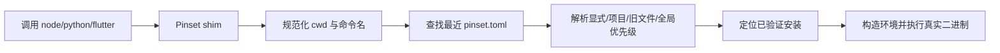
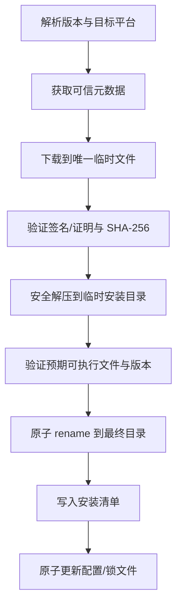

# Pinset 技术架构

状态：候选架构，等待关键技术 spike  
实现语言：Rust

## 1. 总体结构

首版避免过度拆分，建议使用一个 Cargo workspace：

```text
pinset/
├─ crates/
│  ├─ pinset/          # 用户 CLI
│  ├─ pinset-core/     # 配置、解析、安装、provider、诊断
│  └─ pinset-shim/     # 极小的命令路由程序
├─ docs/
└─ tests/
   ├─ fixtures/
   └─ integration/
```

`pinset-core` 内部模块：

```text
config       lockfile      resolver
store        installer     downloader
archive      verification  process
shim         doctor        legacy
providers/
  node
  python
  flutter
```

只有在模块边界经过实现验证后再拆成更多 crate。

Phase 0 已确认安装器需要通过 `installer` Cargo feature 隔离。单独构建 `pinset-shim` 时不得引入 reqwest、TLS、SHA-256 或 ZIP 依赖，避免把下载器的编译和供应链体积带入每次命令执行的极小二进制。

## 2. 数据目录

支持 `PINSET_HOME` 显式覆盖。默认目录需要在 ADR 中冻结，候选为：

- Windows：`%LOCALAPPDATA%\Pinset`
- macOS/Linux：遵循平台 data directory/XDG 约定

内部结构：

```text
PINSET_HOME/
├─ downloads/                  # 内容寻址或版本化下载缓存
├─ installs/<tool>/<version>/<target>/
├─ shims/
├─ state/                      # 安装清单、全局选择、缓存索引
├─ locks/                      # 进程间文件锁
└─ tmp/                        # 唯一事务目录
```

安全约束：

- 卸载只能操作登记在安装清单中且解析后仍位于 `installs/` 下的路径；
- 不对数据根、用户主目录或动态 glob 执行递归删除；
- 临时目录与最终目录必须位于支持原子 rename 的同一文件系统；
- 用户可导出配置与锁文件，删除 Pinset 不影响项目源文件。

## 3. 命令解析



要求：

- shim 通过 `argv[0]` 识别命令；
- Windows 可使用复制/硬链接生成 `.exe` shim，Unix 可使用硬链接或符号链接；
- 解析结果可按 cwd、配置路径和文件元数据缓存，但缓存错误不能改变正确性；
- 运行时执行路径不访问网络；
- 检测并拒绝 shim 自递归；
- 子进程继承必要环境，但 Pinset 内部变量和敏感日志遵循最小暴露。

## 4. 安装事务



失败语义：

- 任一步失败都不修改当前选中版本；
- 校验失败的文件隔离或删除，不进入共享可信缓存；
- 并发安装同一产物使用跨进程锁，等待者复用成功结果；
- 崩溃后启动时清理有年龄阈值且确认属于 Pinset 的临时目录；
- 最终安装目录只在完整验证后可见。

## 5. Provider 接口

内置 provider 使用统一接口，但版本语义可以不同：

```rust
trait Provider {
    fn resolve(request: VersionRequest, target: Target) -> ResolvedVersion;
    fn artifacts(version: ResolvedVersion, target: Target) -> Vec<Artifact>;
    fn verify(metadata: TrustedMetadata, artifact: DownloadedArtifact) -> Verification;
    fn layout(install_root: Path) -> RuntimeLayout;
    fn commands(layout: RuntimeLayout) -> Vec<CommandMapping>;
    fn validate(layout: RuntimeLayout) -> ValidationResult;
}
```

这是概念接口，不是已冻结代码。Node semver、Python PEP 440/构建标签和 Flutter channel/ref 不能强行压成一个字符串比较器。

### Node provider

- 版本索引：Node.js 官方 `dist/index.json`；
- 产物：官方归档；
- MVP 信任链：官方 HTTPS `SHASUMS256.txt` → 归档 SHA-256；稳定版目标为授权发布密钥 → 签名 SHASUMS → 归档哈希；
- 布局映射：`node`、`npm`、`npx`、`corepack`。

当前 Node-first MVP 已实现：

- 只接受不带前导 `v` 的精确稳定版本 `x.y.z`；
- 锁定 `windows-x86_64`、`linux-x86_64`、`macos-x86_64` 和 `macos-aarch64` 四个目标；
- Windows 生成官方 `.zip` 路径，Linux/macOS 生成官方 `.tar.xz` 路径；
- canonical URL 始终来自内置 official 源；
- 实际下载候选按本机 active → ordered fallback 构造；
- 自定义镜像只替换 base URL，不改变 artifact path 或 canonical identity；
- artifact path 必须是 ASCII 安全相对 URL 路径，拒绝前导 `/`、`..`、反斜杠、百分号编码、scheme、query 和 fragment；
- 归档内部布局使用 `/` 分隔的 target 路径字符串，不使用宿主机 `PathBuf` 语义规划其他平台产物。

元数据客户端只接受精确稳定版本，在联网前验证输入，从 Node 官方 HTTPS 发布目录解析 `SHASUMS256.txt`，并要求四个平台产物的哈希全部存在。事务安装器支持安全 ZIP 与 TAR.XZ 解压、归档根目录剥离、路径穿越和特殊条目拒绝、展开上限、SHA-256 强制校验及原子提交。PGP 签名验证尚未实现，因此文档不会把 HTTPS 清单描述为已签名验证。

### Python provider

- 版本/产物：固定的 python-build-standalone 清单；
- 信任链：Pinset 固定的清单来源与归档哈希，最终形式由 spike 决定；
- 记录 `PYTHON.json` 与许可证元数据；
- 布局映射根据归档实际内容生成，不假设所有平台文件名相同。

### Flutter provider

- 版本索引：三平台官方 release JSON；
- 产物：官方 Flutter SDK archive；
- 信任链：release JSON 中 SHA-256，后续接入官方 provenance；
- 布局映射：`flutter`、bundle 内 `dart`；
- SDK 根路径必须可供 IDE 查询。

## 6. 配置与锁文件

- 使用 `toml_edit` 类保留格式能力（具体依赖在实现时评估）；
- 写入采用临时文件、flush、必要时 fsync、原子替换；
- 锁文件有独立 schema 版本；
- 未识别的新 schema 默认拒绝修改；
- 读取项目配置时不加载远程文件、不展开 Shell、不执行插件；
- 祖先查找要定义 Git worktree、挂载点、符号链接和权限失败的边界。

## 7. PATH 与 Shell 集成

安装 Pinset 后只需将 `PINSET_HOME/shims` 加入 PATH 一次。Pinset 不声称能修改已运行的父 Shell。

设置流程：

1. 检测当前 Shell 和候选 profile；
2. 展示将要写入的精确行；
3. 得到用户确认后进行带标记、可幂等移除的最小修改；
4. 提示重启终端或给出当前 Shell 的手动加载命令；
5. 运行 `pinset doctor` 验证实际 PATH 顺序。

CLI 日常切换不依赖目录切换 hook。

## 8. IDE 集成

终端 shim 不能完全解决 IDE 需要 SDK 根目录的问题，Flutter 是首要风险。

候选方案：

- `pinset which flutter --sdk` 返回精确 SDK 目录；
- 项目内 `.pinset/sdks/flutter` 指向选中安装：
  - Unix：符号链接；
  - Windows：目录 junction（必须验证无需提升权限和 IDE 兼容性）；
- 用户可将稳定路径手动填入 IDE；
- 未来 `pinset integrate vscode` 只能在明确授权后写设置，并展示 diff。

不得自动提交机器相关绝对路径。Python IDE 建议使用由 uv 等工具创建的项目虚拟环境，或显式选择 Pinset 解释器。

## 9. 镜像、代理与离线

- 使用系统代理和 CA；支持显式自定义 CA；
- provider 可配置镜像 base URL；
- 可信元数据与预期哈希不能由未信任镜像覆盖；
- 离线模式只使用已验证缓存和锁文件，不查询最新版本；
- 缓存键至少包含 provider、精确版本、target、哈希；
- 内容相同的缓存可复用，来源和验证记录不能丢失；
- 下载断点续传延后到基础事务正确后实现。

### 9.1 安装源模型

产物身份与下载源分离：

```text
可信 provider/lock
  ├─ exact version
  ├─ canonical URL + artifact path
  ├─ expected SHA-256
  └─ signature/provenance

本机 source config
  ├─ active source
  ├─ ordered fallback sources
  └─ base URL / HTTPS policy / source classification
```

provider 将同一 `artifact_path` 映射成有序候选：

```text
npmmirror  https://npmmirror.com/mirrors/node/<artifact_path>
official   https://nodejs.org/dist/<artifact_path>
```

安装器收取 `canonical_url`、不可变的预期 SHA-256，以及有序 `ArtifactSource`。已实现的回退规则：

- DNS、连接、超时、HTTP 不可用或响应中断：可以尝试下一个用户批准的源；
- Content-Length/下载上限异常：硬停止；
- SHA-256、签名或 provenance 不匹配：硬停止，不回退；
- 本地写入、解压和权限错误：硬停止；
- 收据记录 canonical URL、实际 source id/kind 和脱敏后的实际 URL。

项目配置不能声明任意镜像 URL，避免克隆仓库触发意外第三方网络请求。活动源是本机偏好，默认不写入 `pinset.lock`，从而保证国内外团队成员共享同一锁文件。

已实现的 `sources.toml` 规则：

- `node`、`python`、`flutter` 各有一个只读内置 `official` 源；
- 用户添加的源统一分类为 `custom`，不能自行冒充 `official` 或未来的受维护 `community` preset；
- 默认强制 HTTPS；HTTP 需要逐源显式记录 `allow_insecure = true`；
- 拒绝 URL 内嵌凭据、query 和 fragment，避免秘密进入配置、日志或收据；
- `active` 与 fallback 不得重复，fallback 不得有重复或悬空别名；
- 活动源和 fallback 引用的源不能删除；
- 保存使用同目录临时文件和原子 replace，不直接截断已有配置。

### 9.2 元数据与产物镜像

必须区分：

- **产物镜像**：只替换大文件下载地址；哈希/签名来自 lock 或可信元数据；
- **元数据镜像**：影响版本发现和哈希，只有在元数据可用官方密钥或 Pinset 签名快照验证时才可作为信任来源。

Node 的签名 SHASUMS 可以验证产物，但镜像版本索引仍可能存在回滚/缺失；Flutter release JSON 本身不能直接信任任意镜像替换。对 `latest`/`stable` 等浮动选择器，Pinset 应优先从可信元数据解析；无法验证新鲜度时要求精确版本或已有 lock。

## 10. 旧管理器诊断

`doctor` 使用只读探针：

- 枚举 PATH 中所有目标命令，而不只调用第一个；
- 解析常见管理器的 shim/安装目录特征；
- 报告 Shell profile 中 Pinset 与其他初始化段的相对顺序；
- 比较项目 Pinset 配置、旧版本文件、全局选择和真实命令；
- 输出建议，不自行删除、禁用或改写。

诊断模型应区分：

- “已安装但未生效”；
- “当前 PATH 遮蔽 Pinset”；
- “Pinset shim 生效但项目未声明”；
- “多个配置文件值冲突”；
- “IDE 使用的 SDK 与终端不同”。

## 11. 插件策略

v0.1 只有内置 provider，不加载第三方代码。

未来若开放插件，优先研究带能力声明的 WASM：

- 网络域名白名单；
- 只读版本元数据与受限下载接口；
- 不直接访问用户项目文件；
- 不执行 Shell；
- 插件签名、来源锁定和显式信任。

在这些边界无法可靠实现前，不以插件数量作为产品指标。

## 12. 安全要求

- 解压前校验大小上限、文件数量和总展开大小；
- 拒绝绝对路径、`..`、设备文件及逃逸链接；
- Windows 长路径、保留名和大小写碰撞有测试；
- 校验比较使用安全实现，错误不降级为警告；
- provider 元数据有超时、大小限制与严格解析；
- 代理凭据、请求头和 token 不进入普通日志；
- 发布二进制提供校验和、SBOM 与构建证明；
- 依赖使用锁文件、漏洞扫描和最小 feature 集。

## 13. 测试架构

单元/属性测试：

- 各版本选择器；
- 配置优先级；
- 路径规范化和数据根边界；
- lock 确定性；
- 目标平台与产物匹配。

集成测试：

- 本地假 HTTP 服务；
- 错误哈希、截断下载、超时、代理和离线；
- 恶意压缩包 fixture；
- 并发安装和进程中断；
- shim 的递归、PATH 冲突和嵌套目录。

端到端测试：

- 认证平台真实上游产物；
- Node、Python、Flutter 各安装、执行、切换、卸载；
- Shell、CI 与至少一个 Flutter IDE 流程；
- 发布候选二进制的全新机器安装。
